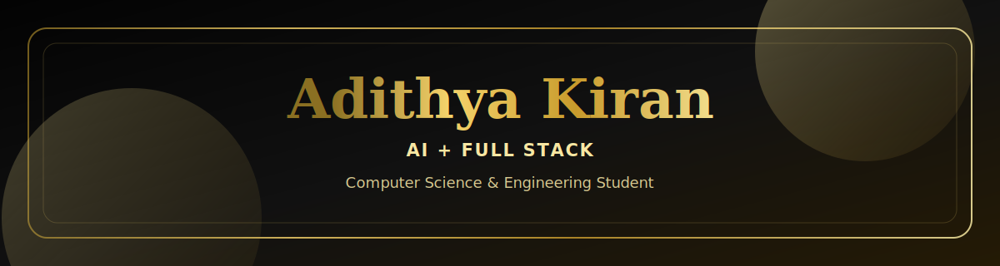

<div align="center">



<br />


<br /><br />


</div>

---

<table>
  <tr>
    <td width="60%" valign="top">

## About

I am a **3rd Year Computer Science & Engineering student** at **TKM College of Engineering**, focused on building practical software systems and exploring intelligent applications using **Full Stack Development**, **Machine Learning**, **Deep Learning**, and **Large Language Models**.

I care about writing code that is clean, maintainable, and useful beyond just working on the surface.

### Current Focus

- Full-stack application development with the **MERN stack**
- Machine Learning and Deep Learning fundamentals
- NLP, LLMs, and applied AI systems
- Building projects with strong architecture and clean UI

    </td>
    <td width="40%" valign="top">

## Profile

```txt
Name       : Adithya Kiran
Role       : CSE Student
College    : TKM College of Engineering
Focus      : AI + Full Stack
Approach   : Build, learn, refine
```


    </td>
  </tr>
</table>

## Tech Stack

<div align="center">

### Languages


### Frontend


### Backend & Database


### AI / ML


### Tools


</div>

## Engineering Interests

<table>
  <tr>
    <td align="center" width="25%">
      
      <br />
      Clean interfaces, APIs, and scalable web apps
    </td>
    <td align="center" width="25%">
      
      <br />
      Models, data pipelines, and practical ML systems
    </td>
    <td align="center" width="25%">
      
      <br />
      Neural networks, optimization, and representation learning
    </td>
    <td align="center" width="25%">
      
      <br />
      Language systems, agents, and applied AI workflows
    </td>
  </tr>
</table>

## GitHub Activity

<div align="center">


<br /><br />


</div>

## Connect

<div align="center">

<a href="https://github.com/007-Akira">
  
</a>
<a href="https://www.linkedin.com/in/adithya-kiran-08291827b">
  
</a>
<a href="mailto:adithyakiran0001@gmail.com">
  
</a>

</div>

<br />

<div align="center">


</div>
