

  

  

  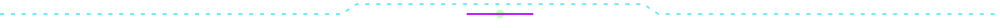

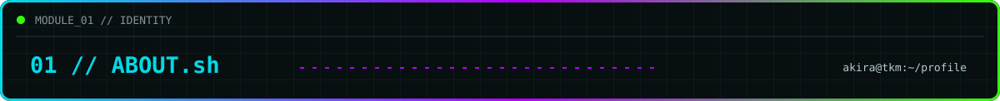

  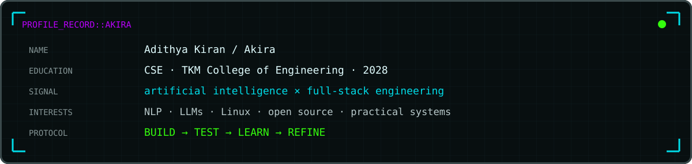

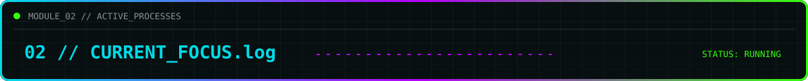

  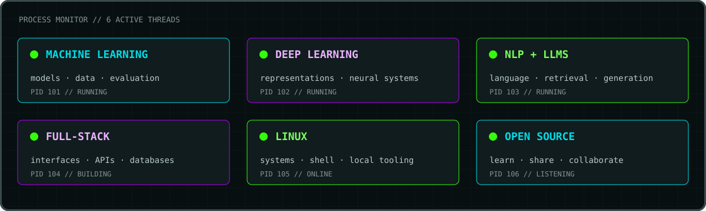

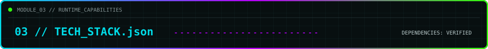

  

  

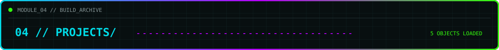

  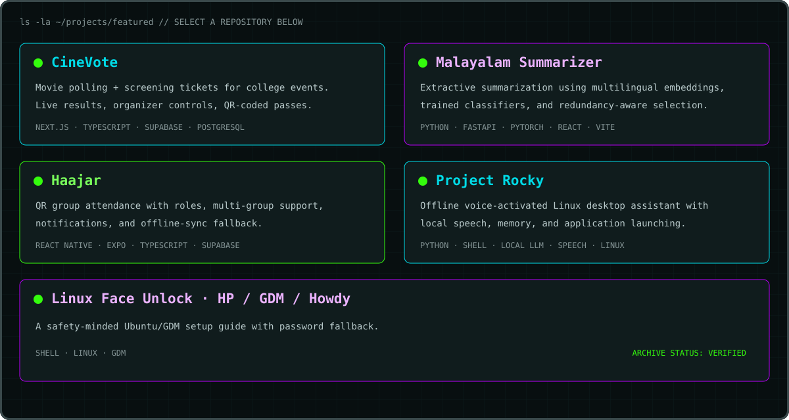

  
  
  
  
  

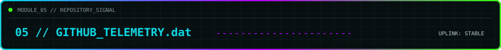

  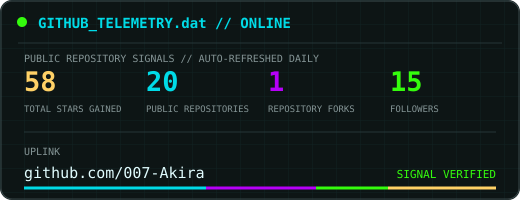
  

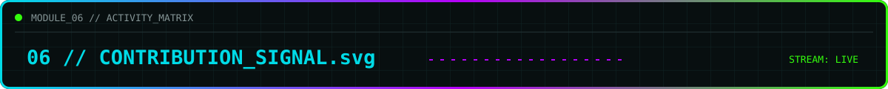

  <picture>
    <source media="(prefers-color-scheme: dark)" srcset="https://raw.githubusercontent.com/007-Akira/007-Akira/output/github-contribution-grid-snake-dark.svg">
    <source media="(prefers-color-scheme: light)" srcset="https://raw.githubusercontent.com/007-Akira/007-Akira/output/github-contribution-grid-snake.svg">
    
  </picture>

<!-- The local contribution signal remains as a fallback if the generated output branch is temporarily unavailable. -->

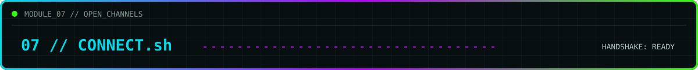

  
  
  

  

